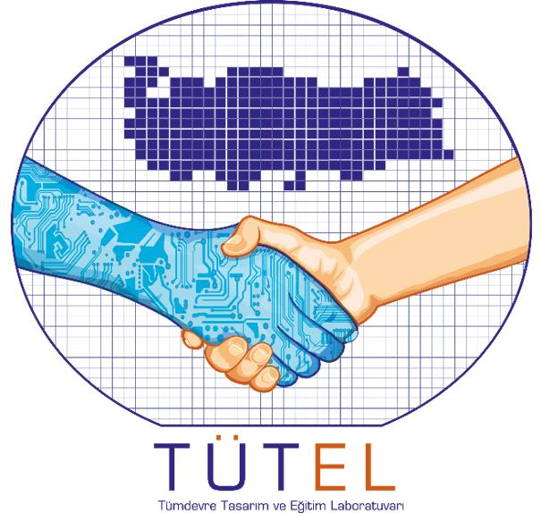

  

# microBee

**microBee** (μBee) is a teaching-oriented RISC-V MCU/SoC platform designed for hands-on embedded systems education. It includes a Vivado IP core (`uBee_soc`), block-design-based laboratory exercises, a UART bring-up example, and an accompanying RV32 emulator.

The initial version of microBee was developed for use in the **EHB326E** course.

microBee is a joint project of the **GSTL** and **TÜBİTAK TÜTEL Bursiyer Laboratuvarı**.

  
  &nbsp;&nbsp;&nbsp;&nbsp;
  

For more information or collaboration opportunities, visit the [GSTL](https://www.gstl.itu.edu.tr/) and [TÜTEL](https://tutel.bilgem.tubitak.gov.tr/) websites, or contact us at [gstl@itu.edu.tr](mailto:gstl@itu.edu.tr) and [tutel@tubitak.gov.tr](mailto:tutel@tubitak.gov.tr).

## Contents

| Path                                                | Purpose                                                                         |
| --------------------------------------------------- | ------------------------------------------------------------------------------- |
| `IP/`                                               | Vivado IP repository containing `uBee_soc`. See [`IP/README.md`](IP/README.md). |
| `Compiled_Assembly_Files/`                          | Precompiled `imem.hex` and `dmem.hex` files for SoC BRAM initialization         |
| `RTL_files/`                                        | Hello UART testbench (`tb_design_1_hello.sv`) and supporting files              |
| `Homework_1/`                                       | Homework material for Chapter 2                                                 |
| `Emulator/RV32_emulator_Student_Guide/`             | Student usage guide in PDF and HTML formats, including examples                 |
| `Emulator/rv32_emulator-main/`                      | RV32IMC emulator, assembler, and debugger                                       |
| `EHB326_Book_MCU_en.pdf` / `EHB326_Book_MCU_tr.pdf` | Course book in English and Turkish                                              |
| `assets/`                                           | Project logos and other visual assets                                           |

## Quick Start — Vivado IP

1. Create a new Vivado project or open an existing one targeting the **Arty A7**.
2. Navigate to **Tools → Settings → IP → Repository** and add the `IP` directory from this repository.
3. Refresh the IP Catalog and add **uBee SoC RV32IMC** to your design.
4. Build the block design by following the instructions provided in the course book.
5. In the `uBee_soc` configuration, set the **IMEM Init File** and **DMEM Init File** parameters to the absolute paths of:

   * `Compiled_Assembly_Files/imem.hex`
   * `Compiled_Assembly_Files/dmem.hex`
6. Run the simulation using `RTL_files/tb_design_1_hello.sv` as the simulation top module (`tb_design_1_hello`).

A successful simulation should produce the following UART output:

`Hello from uBee on Arty A7`

The UART is configured for **9600 baud** with a **100 MHz** system clock.

> **Note:** Do not move files out of `IP/uBee_soc/` unless the existing relative directory structure is preserved. The IP is designed to be self-contained and uses relative paths for its source files.

## Emulator

For emulator usage, start with the student guide located in:

[`Emulator/RV32_emulator_Student_Guide/`](Emulator/RV32_emulator_Student_Guide/)

The guide is available as both `RV32 Student Usage Guide.pdf` and `.html`.

Source code, installation instructions, and additional information about the emulator are available in:

[`Emulator/rv32_emulator-main/README.md`](Emulator/rv32_emulator-main/README.md)
